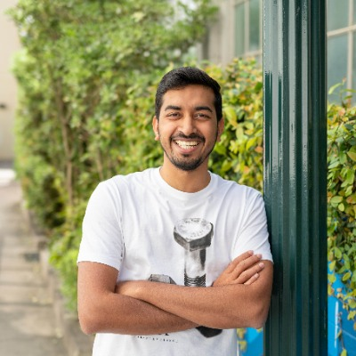

---
hide:
  - toc
  - navigation
---

# &#128172; Connect with Us

You can follow and reach out to the OWASP SCS team in many ways.

- Send us your questions and ideas to GitHub Discussions
- Stay always up-to-date by following us on Twitter.
- Join our Slack community

If you'd like to contribute, take a look at our [Contributions page](contributing.md) or reach out to the project leaders Carlos or Sven.

[:material-github:](https://github.com/OWASP/owasp-scs/discussions)
[:material-twitter:](https://twitter.com/owasp_scs)
[:material-slack:](https://owasp.slack.com/archives/C07MNDE6TPZ)

> [Request an invitation](https://owasp.slack.com/archives/C07MNDE6TPZ) to join our Slack channel `#owasp-scs`

 

## OWASP SCS Project Leaders

## Shashank
[@cyberboyIndia](https://x.com/cyberboyIndia)

Shashank brings over a decade of expertise in uncovering vulnerabilities, reporting them to reputable institutions, conducting pentests, and overseeing responsible disclosure and bug bounty initiatives. His contributions have earned him a place in the Security Hall of Fame for Apple (CVE-2017-7063, CVE-2017-7062, CVE-2017-2458), Twitter, Google, Facebook, Dropbox, and more than 40 other organizations, showcasing his knack for identifying significant security concerns.
Apart from Bug Bounties, Shashank has worked as a security analyst for HackerOne and performed 200+ pentests with Cobalt. He was also a security engineer for Web3 Company Avalanche before starting his venture [CredShields](https://credshields.com) where he is building an AI-powered cloud-based Smart Contract Security Scanner called [SolidityScan.com](https://solidityscan.com)

[:material-github:](https://github.com/shashank-in)
[:material-twitter:](https://twitter.com/cyberboyIndia)
[:material-slack:](https://owasp.slack.com/team/U07DDRG0ANM)
[:material-email:](mailto:shashank@credshields.com)
[:material-linkedin:](https://linkedin.com/in/shashank-in)

 

## OWASP SCS Project Maintainers

---
## Pratik Lagaskar
[@warlordsam077](https://www.linkedin.com/in/pratik-lagaskar/)

Pratik is a Security Researcher at [CredShields](https://credshields.com), focused on postmortems of web3 rekts, TX analysis & OSINT, tokenomics, and research into web3 security. Previously, Pratik has worked in traditional security with expertise in Red Teaming, code reviews (with proficiency in linters, fuzzers, CodeQL, Semgrep, CxQL), DevSecOps, hypervisor and browser security. He also holds various web2 security certifications. Pratik is very active in all types of CTFs, a major contributor to GSoC and OWASP; and has also won multiple hackathons. He has in-depth working experience with Go, Rust and good understanding of Solidity and Move. Currently, he is dabbling with web3sec and expanding his knowledge in EVM internals, various DeFi protocols, altchains (Cosmos, Solana), node reviews, hash-based snargs and Formal Verification (CVL, Coq and Dafny). When he is not working, Pratik spends majority of his free time strengthening audit skills by participating in contests and bug bounties. 

[:material-github:](https://github.com/WarlordSam07/)
[:material-twitter:](https://x.com/warlordsam077)
[:material-home:](https://pratiklagaskar.com)
[:material-slack:](https://owasp.slack.com/team/U05LH9JSBM1)
[:material-email:](mailto:pratik.lagaskar@owasp.org)

 

---

## Nehal Pillai
[@nehal_10_0](https://x.com/nehal_10_0)

Nehal Pillai has been a security researcher at [CredShields](https://credshields.com) and a cybersecurity graduate student at the University of Maryland, College Park. At CredShields, he has been a part of the team developing [SolidityScan](https://solidityscan.com), an AI-powered cloud-based Smart Contract Security Scanner, driving innovation in smart contract security. With a deep passion for ethical hacking and as an OSCP-certified professional, Nehal specializes in uncovering vulnerabilities, conducting penetration tests, and securing digital assets. As a bug bounty hunter, Nehal has secured over 100 prominent companies through platforms like HackerOne, including major players like Apple and Google. He proudly represented India at the BlackHat MEA 2022 CTF World Finals, showcasing his expertise on a global stage.In addition, Nehal has identified over 35 vulnerabilities, which have been assigned CVEs and registered under MITRE and NIST NSD, making significant contributions to the cybersecurity community.

[:material-github:](https://github.com/nehalr777)
[:material-twitter:](https://x.com/nehal_10_0)
[:material-slack:](https://owasp.slack.com/team/U07PD9KBPAL)
[:material-email:](nehalrajesh10@gmail.com)
[:material-linkedin:](https://www.linkedin.com/in/nehal-pillai/)

 

